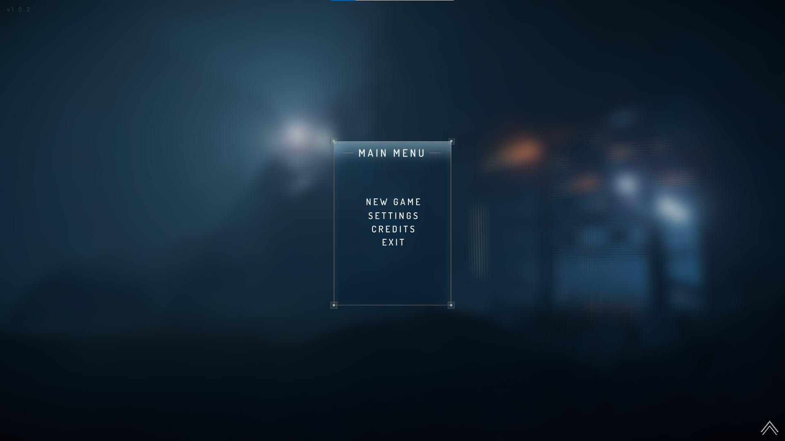
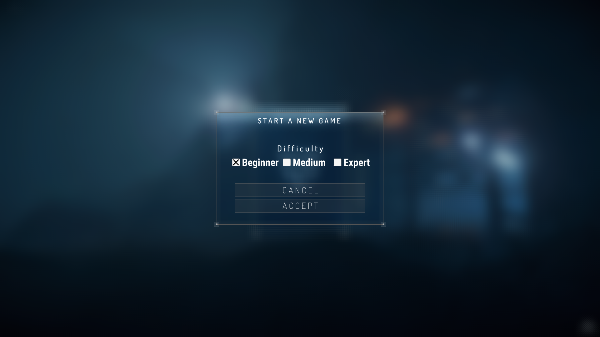
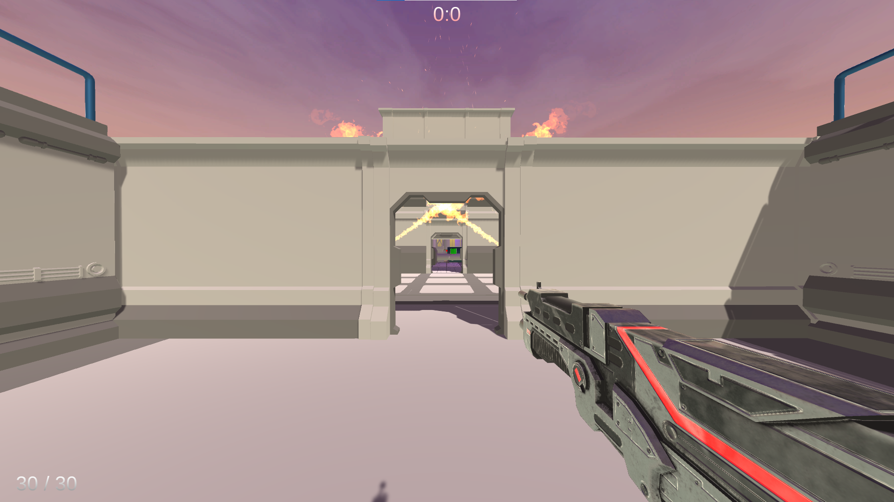

# FreeRun: The Ultimate 3D Parkour Game

## Project Overview

Welcome to FreeRun, an exciting first-person perspective (FPS) game where players can utilize various abilities such as running, jumping, crouching, sliding, wall running, rope swinging, aiming, and shooting to progress through different maps and overcome obstacles. The objective of the game is to reach the finish line by efficiently navigating the challenges presented in three different difficulty levels - easy, medium, and hard.

## Features

- First-person perspective gameplay.
- Various player abilities, including running, jumping, crouching, sliding, wall running, rope swinging, aiming, and shooting.
- Three different maps with increasing difficulty levels.
- Engaging obstacles and challenges to test the player's skills.

## Contributors

- **Hasan Erdem Ak**
  - Implemented menus and menu transitions.
  - Set up lighting for scenes.
  - Added camera shaking effect.
  - Created weapon mechanics script and added weapon sound.
  - Designed the medium difficulty level scene.

- **Erdem Akyüz**
  - Added wall running mechanics.
  - Implemented sliding mechanics.
  - Created rope swinging mechanics.
  - Designed the hard difficulty level scene.

- **İzlem Deniz Kaya**
  - Designed the skybox.
  - Created the easy difficulty level scene.
  - Added sound effects.

## Screenshots

## Sample Gameplay

## How to Setup and Play

1. Clone this repository to your local machine.
2. Open the Unity project using Unity Hub.
3. Navigate to the main menu scene and hit the play button to start the game.
4. Choose the desired difficulty level.
5. Use the keyboard and mouse to control the player's movements and abilities.
6. Progress through the map, avoiding obstacles, and reach the finish line as fast as possible.

## Controls

- **W, A, S, D:** Move the player.
- **Mouse Movement:** Adjust camera view.
- **Space:** Jump.
- **Left Control:** Slide.
- **Left Mouse Button:** Shoot.
- **Right Mouse Button:** Throw rope.

## Feedback and Bug Reports

If you encounter any issues while playing the game or have suggestions for improvements, please feel free to open an issue on this GitHub repository. We appreciate your feedback!